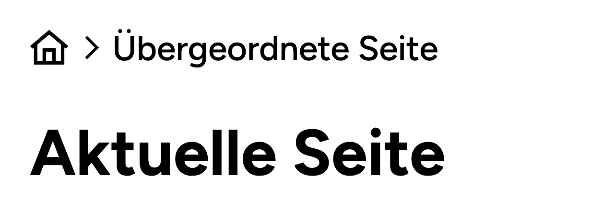

# UD Block: Breadcrumb

Der Block zeigt eine dynamische Breadcrumb-Navigation an.
Im Gegensatz zu vielen anderen Breadcrumb-Plugins wird die aktuelle Seite **nicht** im Breadcrumb-Pfad angezeigt – das verhindert doppelte Titel und sorgt für klarere Layouts.

## Funktionen
- Gutenberg-Block für Breadcrumb-Navigation
- Aktuelle Seite wird bewusst nicht im Pfad angezeigt (vermeidet Wortdopplung, klareres Layout)
- Automatische Generierung anhand der Seitenhierarchie
- Serverseitige Ausgabe über render.php
- Erweiterbar über Filter (breadcrumb_block_get_items)
- Volle Kontrolle über HTML- und CSS-Struktur durch eigene Templates und Styles

## Screenshots

*Frontend-Darstellung des Breadcrumb-Blocks im Standard-Theme.*

## Autor

[ulrich.digital gmbh](https://ulrich.digital)

## Lizenz

GPL v2 or later
[https://www.gnu.org/licenses/gpl-2.0.html](https://www.gnu.org/licenses/gpl-2.0.html)

<!--
Eingesetzt in den Projekten
- illgau.ch
- schule.illgau.ch
- bbzg.ch
-->